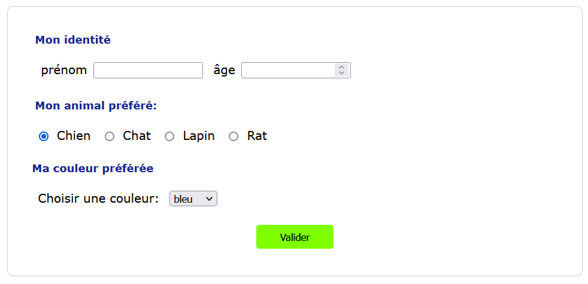
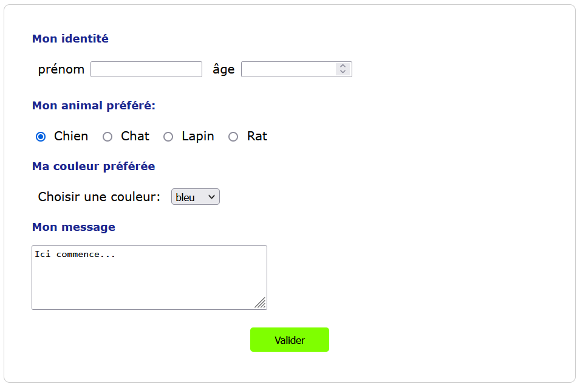

Exercices
=========

Exercice 1
----------

.. _liste déroulante: https://developer.mozilla.org/fr/docs/Web/HTML/Element/select

On reprend le formulaire de l'activité pour cet exercice.

Une liste déroulante contient plusieurs valeurs et permet de faire un choix parmi les valeurs proposées. En html, la liste déroulante est implémentée par:

- la balise ``<select>`` et ``</select>`` qui contient l'attribut ``name`` pour nommer la liste;
- entre ces 2 balises, les balises ``<option>`` et ``</option>`` contenant l'attribut ``value`` associée à chaque valeur de la liste.

On a donc un code qui ressemble à:

.. code-block:: html

    <select name='ma_liste'>
        <option value='valeur 1'>Ma première valeur</option>
        <option value='valeur 2'>Ma seconde valeur</option>
    </select>

Vous trouverez une documentation plus complète sur le site de la fondation Mozilla à propos de la `liste déroulante`_.

Vous devez compléter le formulaire avec une liste déroulante contenant 5 couleurs.

Exercice 2
----------

.. _zone de texte: https://developer.mozilla.org/fr/docs/Web/HTML/Element/textarea

On reprend le formulaire de l'activité pour cet exercice.

Une zone de texte permet de saisir un message sur plusieurs lignes.

En html, une zone de texte est implémentée par:

- la balise ``<textarea>`` et ``</textarea>`` qui contient les attributs ``name`` pour nommer la zone, ``rows`` qui définit le nombre de ligne de la zone et ``cols`` qui définit le nombre de colonnes de la zone de texte;
- entre ces 2 balises se trouve un exemple de texte (non obligatoire).

On a donc un code qui ressemble à:

.. code-block:: html

    <textarea name="message" rows="4" cols="40">Le message par défaut</textarea>

Vous trouverez une documentation plus complète sur le site de la fondation Mozilla à propos de la `zone de texte`_.

Vous devez compléter le formulaire avec une zone de texte contenant de 4 lignes et 40 colonnes pour la saisie.

    