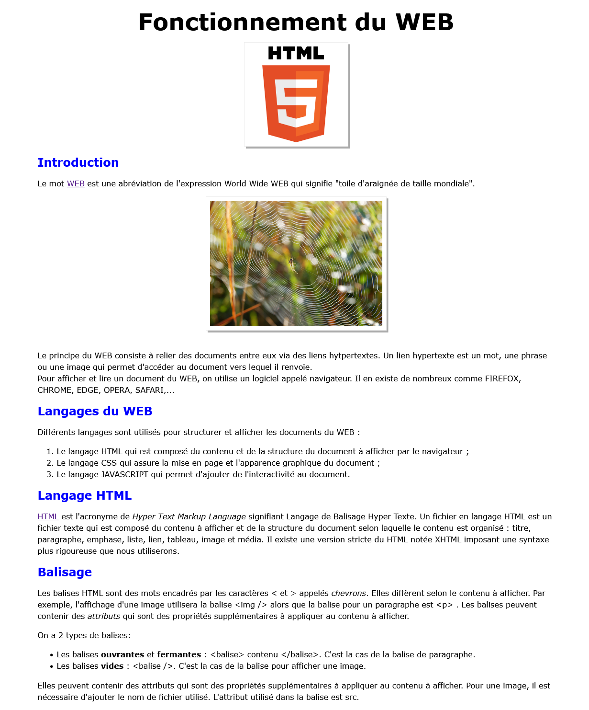

.. 1NSI

.. toctree::
   :maxdepth: 1

.. _wikipedia du mot WEB: https://fr.wikipedia.org/wiki/World_Wide_Web
.. _wikipedia du mot HTML: https://fr.wikipedia.org/wiki/Hypertext_Markup_Language
.. _mozilla: https://developer.mozilla.org/fr/docs/Glossary/Entity

Le langage html
===============

Le document ci-dessous langage_html est une image contenant une page Web. Son apparence ne laisse rien apparaître du
langage utilisé pour obtenir cette présentation.

   Page en langage html
   
#. Une page web est structurée selon les éléments qu’elle contient. On va identifier sur l’image ci-dessus au moins 5
   éléments structurant le contenu de cette page web.

   a. Vous encadrerez dans la même couleur les éléments de même type.

   b. Légender vos cadres de couleurs en indiquant chaque type de contenu.

#. Dans un paragraphe, des contenus peuvent être mis en évidence pour
   attirer l’attention.

   a. Identifier les différentes possibilités de mettre en évidence un contenu.

   b. Compléter votre légende.

#. Une page web est écrite en langage **html**. Ce langage utilise des
   **balises** pour structurer les contenus d’un texte. Le tableau
   ci-après donne les principales balises du langage html pour
   structurer un texte.

   .. csv-table::
      :file: ../csv/balise_html.csv
      :header-rows: 1
      :widths: 10, 15,20
      :delim: ;

   Associer les balises html aux différents types de contenus de votre légende.

#. Le contenu de la page web est dans un fichier texte, disponible sur l’ENT et visible sur la figure suivante.

   .. image:: ../img/langage_html_txt.png
      :alt: image

   a. Ouvrir ce fichier avec l’éditeur notepad++ et ajouter les balises html.

   b. Sauvegarder votre fichier avec une extension html et l’ouvrir avec un navigateur.

#. Afficher votre page html et activer les outils de développement (F12) et sélectionner l’onglet **inspecteur** (vous
   pouvez aussi faire un clic droit de souris et sélectionner inspecter).

   a. Quelles sont les balises ajoutées par le navigateur alors qu’elles ne sont pas présentes dans votre fichier ?
      Ajouter les à votre fichier en respectant bien la structure du document.

   b. Si nécessaire, vous pouvez tester des correctifs dans le navigateur et lorsqu’ils sont validés, modifiez votre
      fichier html dans l’éditeur.

#. Ajouter les liens hypertextes suivants:

   a. Un lien vers la page `wikipedia du mot WEB`_ dans le paragraphe introduction.

   b. Un lien vers la page `wikipedia du mot HTML`_ dans le paragraphe langage HTML.

#. L’affichage des balises ``<balise>`` et ``</balise>`` n’est pas correct. Cela s’explique par le fait que le navigateur
   essaie d’interpréter ces balises comme de vraies balises html sans y parvenir. Pour afficher des caractères
   spéciaux, appelés **entités html**, il faut utiliser un encodage propre au html.

   Le site de `mozilla`_ vous guide pour afficher correctement les balises html dans votre document.

#. La balise ``<head></head>`` est actuellement vide. Cette balise rassemble les propriétés du document html nécessaires au
   bon affichage du document par le navigateur.

   a. Quel est le titre de l’onglet de votre document html affiché par le navigateur ?

   b. Pour afficher un titre sur l’onglet, on ajoute la balise ``<title>...</title>``. Ajouter le titre *Première page web*
      pour qu’il apparaisse sur l’onglet.

   c. Les balises ``<meta />`` sont des balises vides qui informent le navigateur sur le document à afficher.

      Par exemple l’attribut ``charset`` indique l’encodage de caractères à utiliser. Ajouter cette balise avec
      l’encodage ``utf-8``.

   d. Modifier l’encodage par ``iso-8859-1`` et actualiser votre page web. Que remarquez-vous ?
