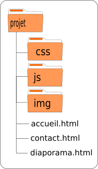
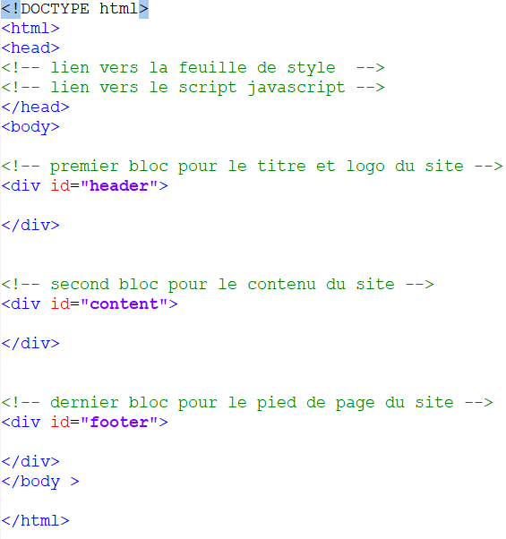

::: {#header}
Mini projet WEB {#mini-projet-web .titre}
===============

{.logo width="160px"}
:::

::: {#content}
Introduction
------------

Ce mini projet a pour objectif de créer un site WEB constitué de trois
pages écrites en langages HTML, CSS et JAVASCRIPT. Le sujet traité par
le site est libre mais doit être relatif à la vie lycéenne comme une
sortie scolaire, un enseignement suivi, la présentation d\'un club, les
activités sportives ou artistiques au lycée, etc.

Les trois pages du site WEB se répartissent ainsi:

1.  La première page est l\'accueil du site;
2.  La seconde page est une exposition de photographies;
3.  La dernière page contient un formulaire de contact.

La charte technique du site
---------------------------

Les fichiers du site sont rassemblés dans un même dossier nommé
**projet**. 

1.  Le dossier **projet** contient les dossiers **css**, **js** et
    **img** ainsi que les trois fichiers HTML **accueil.html**,
    **contact.html** et **diaporama.html**.
2.  Le dossier **css** contient la feuille de style **style.css**.
3.  Le dossier **js** contient les 2 fichiers javascript **slide.js** et
    **formulaire.js**.
4.  Le dossier **img** contient toutes les photos et images du site WEB.

Les fichiers HTML
-----------------

Les fichiers HTML ont la même structure appelée **squelette** utilisé
pour toute page HTML avec les balises html, head, title, body, etc. Le
contenu placé entre les balises \<body\> et \</body\> est divisé en
trois blocs délimités par les balises html \<div\> et \</div\>.

Un modèle de page web est donné pour la mise en place de ces trois
blocs. Il sera à adapter pour chacune de vos pages.

1.  Le premier bloc contient le titre du site WEB présent sur les trois
    pages WEB.
2.  Le second bloc est dédié au contenu différent pour chaque page du
    site.
3.  Le dernier bloc est un pied de page que l\'on retrouve sur les trois
    pages.

### Titre du site web

Le premier bloc \<div\> et \</div\> a un attribut **id** de valeur
*header*. La mise en forme **css** se fait sur cet identifiant. Il ne
faut pas le modifier sous peine de perdre tous les apports graphiques.

Dans ce bloc vous devez insérer:

-   Le titre du site qui est un titre de niveau 1
-   Un logo pour le site qui est une image dont la taille ne dépasse pas
    les 160 px.

### Contenu des pages web

Le second bloc \<div\> et \</div\> a un attribut **id** de valeur
*content*. La mise en forme **css** se fait sur cet identifiant. Il ne
faut pas le modifier sous peine de perdre tous les apports graphiques.

Dans ce bloc vous devez insérer:

-   Pour la page accueil, un texte de plusieurs lignes, une image et au
    moins deux liens hypertextes vers des sites externes de votre choix
    en lien avec le sujet traité.
    -   Les contenus seront placés dans des paragraphes,
    -   L\'image a une largeur inférieure à 800px et une hauteur
        inférieure à 400px.

-   Pour la page diaporama, vous devez insérer des photos et deux
    boutons pour passer d\'une photo à l\'autre. 
    -   Le bouton placé à gauche contient le texte **\<**.
    -   Les images sont placées dans une liste non ordonnée **ul**.
        Attention aux dimensions des photos qui doivent être adaptées à
        la largeur de la page WEB.
    -   Le bouton de droite contient le texte **\>**.

-   La page contact contient un formulaire avec les champs nom, message
    et un bouton d\'envoi.

    

    Ce formulaire se crée avec la balise **form** et contient les
    éléments suivants:

    -   Les balises **labels** qui ont pour valeur *Votre nom* et *Votre
        message*.
    -   La balise **input** pour la saisie du nom a pour identifiant
        *nom*. D\'autres attributs peuvent être ajoutés.
    -   La balise **textarea** permet la saisie d\'un texte sur
        plusieurs lignes. Vous trouverez de la documentation en ligne
        sur le [site de
        Mozilla](https://developer.mozilla.org/fr/docs/Web/HTML/Element/Textarea).
        Cette balise a pour identifiant *message*.
    -   Le bouton d\'envoi du message et de type *submit* et a pour
        valeur *Envoyer*.

    **Remarque:** aucune balise **div** n\'est ici utile contrairement à
    ce qui a été fait en classe.

### Le pied des pages web

Le troisième bloc \<div\> et \</div\> a un attribut **id** de valeur
*footer*. La mise en forme **css** se fait sur cet identifiant. Il ne
faut pas le modifier sous peine de perdre tous les apports graphiques.

Dans ce bloc vous devez insérer:

1.  Votre nom et prénom, votre classe et la date de création du site
    sous forme de liste non ordonnée **ul**.
2.  Le mot NSI qui sera centré dans un paragraphe.
3.  Les liens vers les autres pages web du site sous forme de liste non
    ordonnée. Ces liens diffèrent selon les pages.

L\'affichage en CSS
-------------------

La feuille de style est donnée et se nomme **style.css**. Vous devez
l\'insérer sous forme de lien pour que vos trois pages web puissent
l\'utiliser.

### Le titre de la page

Le premier bloc **div** d\'identifiant *header* est réservé à l\'entête
du site. Sa mise en forme graphique dépend des propriétés css à lui
appliquer. Les deux éléments html contenus dans la balise div sont les
balises **h1** et **img**. La mise en forme se fait en ajoutant des
classes css.

1.  Pour le titre de niveau 1, il faut lui attribuer la classe *titre*.
2.  Pour le logo, il faut lui attribuer la classe *logo*.

### Le contenu de la page d\'accueil

Le contenu ne requiert aucune classe spéciale. La mise en forme se fait
avec des propriétés css directement appliquées aux balises qu\'il
contient. Les balises html utilisées pour le contenu sont des balises de
paragraphe, d\'emphase, de listes numérotées et non numérotées, de liens
hypertextes et d\'images.

### Le contenu de la page diaporama

Sans l\'application des propriétés css, le rendu de la page est très
éloigné du résultat final. Pour que les changements apparaissent :

1.  L\'identifiant du bloc **div** change. On remplace *content* par
    *diaporama*.
2.  Pour faire disparaître les puces, on ajoute la classe *diapo* à la
    balise **ul**.
3.  La mise en forme des boutons se fait avec les classes *moins* pour
    le bouton de gauche et *plus* pour le bouton de droite.

### Le contenu de la page contact

Le formulaire ne requiert aucune classe particulière. L\'application des
propriétés css se fait directement sur les balises html du formulaire.

Seule le bouton d\'envoi nécessite l\'ajout de la classe *bouton* pour
prendre l\'apparence souhaitée.

### Le pied de page

Le pied de page se partage en trois parties : gauche, centre et droite.
Ce sont les noms des trois classes css à attribuer aux trois balises
principales qui constituent le pied de page.

### Personnalisation

Vous devez modifier quelques propriétés css en éditant la feuille de
style.

1.  Changer la couleur de fond de l\'entête du site (bleu) dans une
    couleur de votre choix. La propriété css est *background*.
2.  Changer la couleur de fond du pied de page (gris) dans une couleur
    de votre choix.
3.  Changer la couleur des liens situés dans le pied de page dans une
    couleur de votre choix.
4.  Changer la couleur des boutons du diaporama dans une couleur de
    votre choix.
5.  Changer la couleur du bouton d\'envoi du formulaire et la couleur de
    sa bordure dans une couleur de votre choix..

Interactivité en JAVASCRIPT
---------------------------

L\'interactivité est créée pour le diaporama et le formulaire. La page
d\'accueil n\'est pas concernée. On donne deux fichiers javascript dont
un sera à compléter. Les fichiers sont **slide.js** et
**formulaire.js**. Pour que les pages html chargent les scripts, vous
devez ajouter les liens vers ces 2 fichiers.

### Le diaporama

La page contenant le diaporama n\'affiche qu\'une seule photo. Le
fichier javascript **slide.js** contient deux fonctions qui permettent
d\'afficher la photo précédente ou la photo suivante que la page
contient.

1.  La fonction **changeImageDroite()** affiche la photo suivante et
    s\'applique au bouton de droite.
2.  La fonction **changeImageGauche()** affiche la photo précédente et
    s\'applique au bouton de gauche.

Ajouter dans le code html de la page **diaporam.html** les événements
répondants à clic de souris et exécutant les deux fonctions ci-dessus.

Si tout se passe bien, le diaporama permet d\'afficher les différentes
photos en les faisant défiler avec les boutons.

### Le formulaire

En l\'absence de serveur, il n\'est pas utile de créer une requête http
avec la méthode post ou get. On se contente d\'afficher une fenêtre
d\'alerte contenant les informations ajoutées au formulaire.

Éditer le fichier **formulaire.js** qui contient la fonction
**envoiFormulaire()** à compléter. Cette fonction contient :

-   une variable *nom* créer avec le mot **let**.
-   la méthode **document.getElementById(\"nom\").value** récupère la
    valeur saisie dans le champ d\'identifiant **nom** et l\'affecte à
    la variable *nom*.

1.  Créer une seconde variable *msg* et lui affecter la chaine de
    caractères saisie dans le champ message.
2.  Ajouter l\'instruction d\'affichage du nom et du message saisi sous
    forme d\'une fenêtre **alert**.
3.  Arranger l\'affichage pour qu\'il soit sur deux lignes ! Une ligne
    pour le nom et une autre pour le message.

Lorsque votre fonction **envoiFormulaire()** est prête, modifer le code
html de la page de contact pour que la fenêtre d\'alerte s\'affiche
quand on clique sur le bouton d\'envoi.
:::

::: {#footer}
-   Yannick Chistel
-   Classe de 1U
-   Année 2022

NSI

-   [Exposition photos](diaporama.html)
-   [Contactez nous](contact.html)
:::
