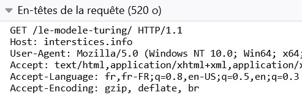

Exercices
=========

Exercice 1
----------

On donne la capture des en-têtes d’une requête HTTP effectuée par un
navigateur.

   Entête d'une requête HTTP

.. figure:: ../img/req4Ex1.jpg
   :alt: image
   :align: center
   :width: 320

   Entête de la réponse

#. Quelle est la méthode utilisée par cette requête HTTP ?
#. Quelle est la ressource demandée dans cette requête ?
#. Cette requête a été exécutée par un navigateur. Quelle url a été saisie ?
#. La ressource demandée a-t-elle été renvoyée par le serveur ? Justifier.
#. Quel est le type de données envoyées par le serveur pour cette ressource?

Exercice 2
----------

On donne la capture d’une requête HTTP effectuée par un navigateur.

   
#. Quelle est la méthode utilisée par cette requête HTTP ?

#. Des données ont été envoyées au serveur par le client. Combien et comment ?

#. Quelle réponse a été fournie par le serveur et sous quelle forme ?

#. On peut effectuer cette requête avec la méthode GET. Comment se réalise-t-elle ?

Exercice 3
----------

Les navigateurs modernes proposent des outils de développement qui permettent aux développeurs de comprendre ce qui se
passe réellement derrière l'affichage d'une page web.

On y accède par le menu qui ouvre une fenêtre contenant de nombreux outils. Un accès clavier est en général disponible.

#. Aller sur le site **interstices.infos** puis effectuer une recherche sur le mot **internet** (avec la loupe).

   a) Quelle est la méthode utilisée pour cette requête ?
   b) Afficher l'en-tête de la requête dans le navigateur en utilisant les outils de développement.

#. Quelle est url qui permet d'effectuer la requête précédente ?
#. Que faut-il modifier dans l'url précédente pour effectuer une recherche sur le mot **turing** ?
#. Comment réaliser une recherche sur les mots **turing** et **internet** en même temps en modifiant l'url précédente ?

Exercice 4
----------

Le module **requests** de Python permet de réaliser des requêtes HTTP.

On utilisera principalement les méthodes suivantes:

-  ``get`` et ``post`` pour effectuer nos requêttes HTTP: ``rep=requests.get('url_du_site')`` ou
   ``rep=requests.post('url_du_site')``
-  ``text`` permet de récupérer le contenu renvoyé par le serveur : ``print(rep.text)`` affiche le contenu.
-  ``headers`` donne le contenu de l’en-tête de la réponse HTTP renvoyé par le serveur : ``print(rep.headers)`` affiche
   l’en-tête de la réponse HTTP.
-  ``status_code`` contient la valeur du code de status de la requête : ``rep.status_code`` renvoie un entier.

Nous allons effectuer les mêmes requêtes que l’exercice précédent en Python.

#. Importer le module **requests** dans votre feuille de programmes.

#. Réaliser une première requêtte HTTP sur le site ``interstices.infos`` avec la méthode ``get``. La réponse de la
   requête sera enregistrée dans la variable ``rep``.

   a) Comment peut-on afficher le code d'état ou le statut de la requête ?
   b) Comment peut-on afficher l'en-tête de la réponse à cette requête serveur.

#. La variable ``page`` doit contenir le contenu de la page web retournée par le serveur. On donne
   ci-dessous une fonction qui écrit dans un fichier le contenu d’une variable.

   .. figure:: ../img/python-open.png
      :alt: image
      :align: center
      :width: 560

   a) Recopier cette fonction sur votre feuille de programmes.
   b) Créer le fichier **ma_page.html** avec le contenu de la variable **page** puis vérifier qu’elle s’affiche
      correctement dans un navigateur.

#. Effectuer une requête GET en passant en paramètre le mot **internet**. Afficher le code d’état de la réponse HTTP.

   a) Enregistrer dans la variable **page** le contenu de la réponse du serveur.
   b) Afficher dans le navigateur le contenu de la variable **page**.

#. On peut affiner la recherche sur le site en utilisant plus de paramètres. Les paramètres disponibles sont :

   -  `s` pour la recherche d'un mot
   -  `fwp_themes` pour le domaine de recherche
   -  `fwp_type` pour le type de ressource recherchée
   -  `fwp_sort` pour l'ordre chronologique d'affichage (date_desc ou date_asc)

   Les valeurs des paramètres sont prédéfinies par le site.

   Pour ajouter plusieurs paramètres dans une requête en python, on peut les inclure dans l'url ou alors utiliser une
   variable `p` qui contient les paramètre et les valeurs. Dans ce cas, on utilise un dictionnaire qui se note entre
   accolades : ``{ 'paramètre 1':'valeur', 'parametre 2': 'valeur', 'parametre 3': 'valeur'}.

   La variable qui contient les paramètres sera placée dans l'appel de la requête, juste après l'url du site, séparé par
   une virgule : ``rep=requests.get('url du site',params = p)

   On va effectuer une recherche approfondie sur le mot "internet", sur le thème "algorithmes", sous forme d'"articles"
   et rangés par ordre chronologique décroissant
   
   a) Effectuer cette recherche sur le site puis relever le nombre de résultats et la date du premier article affiché.
   b) Effectuer la même requete en Python puis enregistre le contenu de la réponse dans le fichier ``ma_page.html``
   c) Afficher dans un navigateur ``ma_page.html`` puis comparer avec la recherche faite sur le site.

Exercice 5
----------

.. _www.httpbin.org: https://www.httpbin.org/forms/post

Le site `www.httpbin.org`_ permet de réaliser une requête avec la méthode POST grace à un formulaire. On va observer
l'envoi des données par ce formulaire et réaliser le même envoi en Python.

#. Compléter le formulaire puis le soumettre avec le bouton placé en bas de page.
#. Quelle est l'url d'envoi de ce formulaire ? Est-elle modifiée ?
#. Relever le nom des différents paramètres utilisé pour l'envoi de ce formulaire.
#. En python, créer une variable `p` contenant les paramètres du formulaire et leurs valeurs.
#. Créer votre requête avec la méthode POST et enregistrer le résultat dans la variable ``rep``.
#. Quel est le type de contenu renvoyé par le serveur. Quelle commande Python permet de le savoir.
#. Créer un fichier contenant le résultat de la requête puis l'afficher dans le navigateur.
